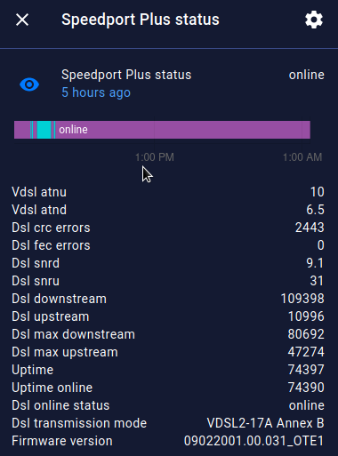

Integrate Sercomm Speedport Plus and ZTE Speedport Entry 2i (VDSL2 modems) with Home assistant using the `command_line` sensor platform.


**Exported statistics**

| Attribute | Description |
| ----------| ----------- |
| vdsl_atnd | Downstream Attenuation (dB) |
| vdsl_atnu | Upstream Attenuation (dB) |
| dsl_crc_errors | CRC errors (total since last DSL sync) |
| dsl_fec_errors | FEC errors (total since last DSL sync) |
| dsl_snrd | Downstream SNR (dB) |
| dsl_snru | Upstream SNR (dB) |
| dsl_downstream | Downstream DSL throughput (Kbps) |
| dsl_upstream | Upstream DSL throughput (Kbps) | 
| dsl_max_downstream | (Speedport Plus only) Max attainable downstream DSL throughput (Kbps) |
| dsl_max_upstream | (Speedport Plus only) Max attainable upstream DSL throughput (Kbps) |
| uptime | (Speedport Plus only) Time since the DSL synchronization |
| uptime_online | (Speedport Plus only) Time since IP connectivity was established (usually 3-10 seconds after sync)
| dsl_sync_status | "Online" if DSL is synced, "offline" otherwise |
| dsl_online_status | "Online" if IP connectivity has been established, "offline" otherwise |
| dsl_transmission_mode | Transmission mode as reported by the modem (e.g. "VDSL2-17A Annex B") |
| firmware_version | Modem firmware version |


## Usage within Home Assistant

Choose the appropriate script for your modem:

- `speedport_plus.py` for Speedport Plus
- `speedport_entry2i.py` for Speedport Entry 2i

**1. Download the python scripts** 

Create a folder named `scripts_cli` under your `/config` Home assistant folder and download there the `speedport_plus.py` or `speedport_entry2i.py` script from this repo. 
If you are new to Home assistant, consider the following ways to do that:  

- If you have installed the "Samba share" addon, you may download the script first in your computer and then create the folder and copy-paste the file by accessing the "/config" share.
- If you have installed the "Terminal & SSH addon", you may `mkdir config/scripts_cli && cd config/scripts_cli` and download the script using `wget` and the **raw** github path to the script. You may also use `git` and clone this repo there.
- If you have installed the "File editor" addon, you may manually create the folder from the menu (top left folder icon) and then create a new file, name it `speedport_plus.py` / `speedport_entry2i.py` and copy-paste the contents from this repo.

All 3 addons are recommended for productive use and management of Home assistant, so you may try any of the suggestions above.

Note: If you are just using Home assistant core installed in a server, then you have to adapt your path to `/path/to/homeassistant/config/scripts_cli`

**2. Configure the new sensor in configuration.yaml**

After you have successfully added the script under `config/scripts_cli/speedport_plus.py` (`config/scripts_cli/speedport_entry2i.py` for the Entry 2i), you may 
edit `configuration.yaml` and create a [command_line](https://www.home-assistant.io/integrations/sensor.command_line/) sensor:

```yaml
sensor:
    - platform: command_line
      name: Speedport Plus status
      scan_interval: 60
      json_attributes:
        - vdsl_atnu
        - vdsl_atnd
        - dsl_crc_errors
        - dsl_fec_errors
        - dsl_snrd
        - dsl_snru
        - dsl_downstream
        - dsl_upstream
        - dsl_max_downstream
        - dsl_max_upstream
        - uptime
        - uptime_online
        - dsl_online_status
        - dsl_transmission_mode
        - firmware_version
      command: 'python3 /config/scripts_cli/speedport_plus.py "http://192.168.1.1"'
      value_template: '{{ value_json.dsl_link_status }}'
```

Change `speedport_plus.py` with `speedport_entry2i.py` above if you have this modem. Also change the path to `/path/to/homeassistant/config/scripts_cli/` if you just use Home assistant core installed in a custom server location.

You may change the `name: Speedport Plus status` above with `name: Speedport Entry2i status` (or whatever you desire) if you have the Entry 2i modem. Just be aware that the dashboards 
shared in this repo have been created with this specific entity name (`sensor.speedport_plus_status`) therefore you will have to search/replace entity names to make them work.


**Configure the router IP**

If the IP of your router is not `192.168.1.1` or if you want to use a hostname, then change `command:` above with the correct http base url 
(including `http://` but without a trailing slash `/`) as the first argument (quoted). For instance if the IP of your router is `10.0.50.1` change the configuration above as follows:

```yaml
      command: 'python3 /config/scripts_cli/speedport_plus.py "http://10.0.50.1"'
```

for the Entry2i:

```yaml
      command: 'python3 /config/scripts_cli/speedport_entry2i.py "http://10.0.50.1"'
```

**Polling interval**

The configuration suggested above will use a default `scan_interval: 60` which means that you will get statistics from
your modem every 60 seconds. You can lower it below 60 seconds but the amount of storage
required to store the statistics will increase accordingly. If you only care about long term statistics
and don't care to catch short term spikes, you may want to increase it to 300 seconds (5 minutes).

**DSL status Vs Internet status**

The configuration suggested above will use the DSL synchronization status as the "online/offline" status of the sensor. You may 
want to change it to indicate full IP connectivity instead (i.e. you have an active PPPoE session). You
can do this by changing the `value_template` field as:

```yaml
      value_template: '{{ value_json.dsl_online_status }}'
```

(`dsl_link_status` was changed to `dsl_online_status`)


**3. Restart Home assistant and then create widgets or automations**

Restart Home assistant and the new sensor will be available as the entity "speedport_plus_status". You may add the new sensor to your dashboards or create automations.

The new sensor entity `speedport_plus_status` (or `speedport_entry2i_status`) will have the values "online" or "offline". The DSL line metrics 
(attenuation, snr, sync speed etc.) will be available as attributes of this entity. 



You may use the sensor status (online/offline) in automations (for instance, restart your router with a smart plug when disconnected). You may also use the numeric attributes using trigger `numeric_state` and selecting an attribute from the list.

Monitoring your Internet connection long term may be more practical with a tool such as Grafana. A sample dashboard is included in this repo. Read the following section for more.


## Attributes as individual sensors

If you want to make some of the DSL attributes available as individual sensors (useful for UI widgets), you may accomplish this with template sensors:

```yaml
sensor:
    - platform: template
      sensors:
          dsl_sync_downstream:
              friendly_name: DSL Sync downstream
              value_template: >-
                  {{state_attr("sensor.speedport_plus_status", "dsl_downstream") | float | multiply(0.001) | round(2) }}
              unit_of_measurement: "Mbit/s"
          dsl_sync_upstream:
              friendly_name: DSL Sync upstream
              value_template: >-
                  {{state_attr("sensor.speedport_plus_status", "dsl_upstream") | float | multiply(0.001) | round(2) }}
              unit_of_measurement: "Mbit/s"
          dsl_errors_crc:
              friendly_name: DSL CRC Errors
              value_template: >-
                  {{state_attr("sensor.speedport_plus_status", "dsl_crc_errors") }}
          dsl_errors_fec:
              friendly_name: DSL FEC Errors
              value_template: >-
                  {{state_attr("sensor.speedport_plus_status", "dsl_fec_errors") }}
```

(Change `sensor.speedport_plus_status` to `sensor.speedport_entry2i_status` in the above snippet if you have the Entry 2i and have chosen this name)

You may also want to compute error rates which are more useful than totals for detecting spikes during the day. We can use the 
Home assistant [derivative](https://www.home-assistant.io/integrations/derivative/) platform to accomplish that. 

(Make sure you have added the invidual sensors as suggested above first)

```
sensor:
    - platform: derivative
      source: sensor.dsl_errors_crc
      name: DSL Error rate (CRC)
      round: 0
      unit_time: h
      unit: "Err/h"
      time_window: "00:05:00"  # we look at the change over the last 5 minutes
    - platform: derivative
      source: sensor.dsl_errors_fec
      name: DSL Error rate (FEC)
      round: 0
      unit_time: h
      unit: "Err/h"      
      time_window: "00:05:00"  # we look at the change over the last 5 minutes
```


## InfluxDB / Grafana usage


InfluxDB and Grafana are available as Home assistant (community) addons. Check the Add-on Store under the Supervisor section.

If you have integrated Home assistant with [InfluxDB](https://www.home-assistant.io/integrations/influxdb/), the
attributes (DSL speed, snr, attenuation etc.) will be also available as seperate "fields" in the default "state" measurement.

The dashboard displayed here is available in this repo under the `Grafana` folder. You may import it into your Grafana instance choosing your InfluxDB data source.

**Sample queries**

In Grafana, if you want to plot the downstream SNR, then you have to choose in the **Visual editor**:

```SQL
FROM default state WHERE entity_id = speedport_plus_status
SELECT field(dsl_snrd) last()
GROUP BY time($__interval) tag(entity_id) fill(none)
```

(this is not an actual InfluxDB query, just the way Grafana UI editor displays the query parts)


In text query mode, this is:

```SQL
SELECT last("dsl_snrd") FROM "state" WHERE ("entity_id" = 'speedport_plus_status') AND $timeFilter GROUP BY time($__interval) fill(none)
```

(`AND $timeFilter` is added by Grafana to allow filtering by time using the top right dropdown menu)

This assumes that you use `state` as the [default measurement](https://www.home-assistant.io/integrations/influxdb/#configuration-variables) name when a metric is "unitless". i.e. in `configuration.yaml` you have:

```yaml
influxdb:
    ...
    default_measurement: state
    ...
```

If it's not the case, then you should adjust the queries above accordingly.


**Rates instead of total stats**

You may compute rates (e.g. errors per minute) instead of totals using InfluxDB transformation functions such as: `non_negative_difference()` and `non_negative_derivative()`.  
Or just use the Home assistant [derivative](https://www.home-assistant.io/integrations/derivative/) platform as described in the previous section.


## Import the included Grafana dashboard

The dashboard displayed here is available in this repo under the `Grafana` folder. When you import it in your Grafana instance you will be asked to choose your InfluxDB data source.

Notes:

- The dashboard has been created for the Speedport Plus modem. If you use an Entry 2i and you have renamed the name of the sensor as "Speedport Entry2i status" 
you'll have to search and replace in the `json` dashboard file all instances of `speedport_plus_status` to `speedport_entry2i_status`.
- If you haven't set `default_measurement: state` as mentioned in the previous section, you'll have to search and replace in the `json` dashboard file all instances of `"measurement": "state"` to `"measurement": "sensor.speedport_plus_status"` (or `sensor.speedport_entry2i_status`).


## Import the included Lovelace dashboard view

A lovelace view (tab in a dashboard) has been shared in this repo under the `lovelace_dashboard_views` folder. 
You have to place it within an existing dashboard (under the `views:` key) using the Raw configuration editor (or by editing the yaml file if you use yaml mode).

The lovelace dashboard depends on the following custom cards (available in Hacs): layout card, mini graph card, entity attributes card.

It also includes widgets that depend on the extra integrations listed in the following section (UPnP, Ping binary sensor for latency, Speedtest.net). 
Of course, if you don't want to use these extra integrations or if you want to use only builtin cards you may adapt the dashboard to your needs.

Finally, you will have to replace the dummy values with real user IDs under the `visible:` key. You may do that in the tab optios in edit mode using the UI 
or you may copy-paste your user IDs from another dashboard yaml configuration.


## Related helpful integrations


**[UPnP/Internet Gateway Device (IGD)](https://www.home-assistant.io/integrations/upnp/)**

If you have UPnP enabled on your router, Home assistant will detect it and offer to add the integration (or you may check manually from the integrations page).
This will output traffic statistics from your home network. It's not very consistent with Speedport Plus but when it works it may provide an indication of (part of) your traffic.


**[Ping (ICMP) Binary sensor](https://www.home-assistant.io/integrations/ping/)**

The ping integration is usually used for presence detection. But you may also use it to check your Internet latency.

```yaml
binary_sensor:
  # Ping an IP of your ISP
  - platform: ping
    host: hostname-or-ip-address-to-ping
    name: "Ping ISP"
    count: 3
    scan_interval: 3600
  # Ping an IP in your city
  - platform: ping
    host: hostname-or-ip-address-to-ping
    name: "Ping City"
    count: 3
    scan_interval: 3600
  # Ping an IP abroad
  - platform: ping
    host: hostname-or-ip-address-to-ping
    name: "Ping Abroad"
    count: 3
    scan_interval: 3600 
```

The examples above will make HASS ping 3 different IP addresses (3 times every 1 hour) and measure the latency.

The binary sensor (connected/not connected) exposes the different round trip times values measured by ping as attributes: round trip time mdev, round trip time avg, round trip time min, round trip time max.


**[Speedtest.net](https://www.home-assistant.io/integrations/speedtestdotnet/) Integration**

You may measure your true download and upload speeds and your ping (latency) with the Speedtest.net integration. 
This way you can compare your DSL sync speed with your actual speed.

Configure the integration from the UI per the instructions in the linked page above. 

- It is advised to not run the test very frequently because it will clog your connection on unpredictable times. I have changed the default to 360 minutes (6 hours).
- It is suggested to set a specific server close to you (see the dropdown in the "Options" menu) so you have consistent results to compare long term.

Note that a Raspberry PI (other than 4B or newer) may limit the reported maximum speed to 100Mbps or 300Mbps (Raspberry PI 3+) due to the slower LAN adapter. 
Also note that this integration uses [speedtest-cli](https://github.com/sivel/speedtest-cli) which may be a little slower than the results you get on Speedtest.net. 
Your true latency may be 7-10ms lower than what is reported from this tool. Read more [here](https://github.com/sivel/speedtest-cli#inconsistency). 
The ping integration mentioned previously is more accurate for measuring latency.

Alternatively you may use the [Iperf3](https://www.home-assistant.io/integrations/iperf3/) or the [Fast.com](https://www.home-assistant.io/integrations/fastdotcom/) integrations.


## Troubleshooting

### Test from the command-line

You may test the script from your PC (if you have python3 installed).

Run without arguments to retrieve data from the default IP address (http://192.168.1.1):

```sh
# for Speedport Plus
python3 speedport_plus.py

# for Speedport Entry 2i
python3 speedport_entry2i.py
```  

If the IP of your router is not `192.168.1.1` or if you want to use a hostname, then supply the http base url 
(including "http://" but without a trailing slash) as the first argument (quoted). For example:

```sh
# for Speedport Plus
python3 speedport_plus.py "http://10.0.50.1"

# for Speedport Entry 2i
python3 speedport_entry2i.py "http://10.0.50.1"
```

The expected response should be similar to:

```json
{"firmware_version": "09022001.00.031_OTE1", "dsl_link_status": "online", "dsl_downstream": 104254, "dsl_upstream": 10996, "dsl_max_downstream": 80692, "dsl_max_upstream": 48300, "dsl_transmission_mode": "...", "dsl_crc_errors": 10825, "dsl_fec_errors": 21, "vdsl_atnu": 10.0, "vdsl_atnd": 6.5, "dsl_snrd": 10.6, "dsl_snru": 31.0, "uptime_online": 285555, "dsl_online_status": "online", "uptime": 285562}
```

### Firmware versions tested

The python scripts have been tested with the following firmware versions:

- Speedport Plus: `09022001.00.031_OTE1`, `09022001.00.030_OTE5`
- Speedport Entry 2i: `V1.0.0_OTET14MAPEA`

If the integration does not work and the command line testing fails or produces different results than suggested above, check whether the device has a new firmware and please open an issue.


